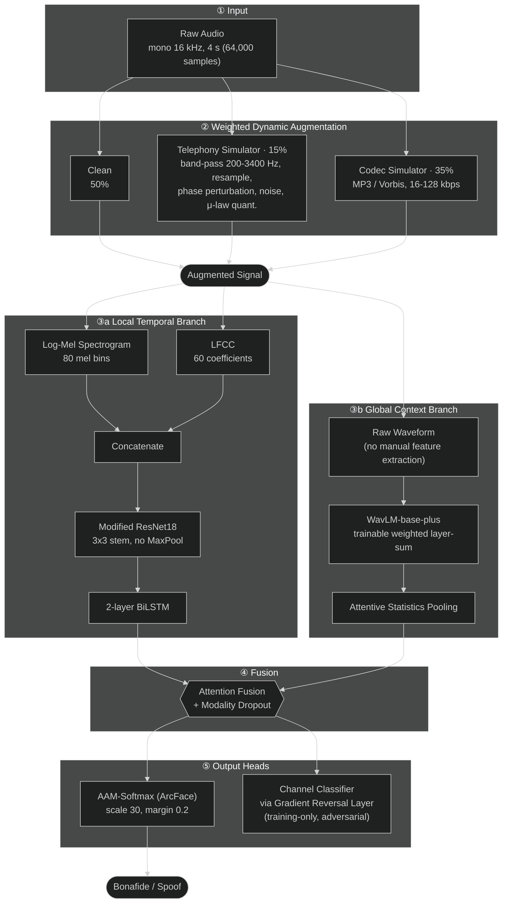

# A Dual-Branch Hybrid Architecture Combining ResNet-BiLSTM and WavLM for Generalizable Audio Deepfake Detection

Pre-thesis research project — Computer Science Department, School of Computer Science, Bina Nusantara University, Jakarta, Indonesia.

**Authors:** Revan Ferdinand, Alfred Dexter, Benedictus Jason, Alvina Aulia

This repository holds the open data references, experiment notebooks, and results for our pre-thesis on generalizable audio deepfake detection. All experiments were run on **Kaggle** (T4×2 GPU environment); this repo is the documentation/index layer, not a local execution environment.

Full paper: 

## Abstract

As generative voice cloning becomes cheaper and more accessible, deepfake audio has enabled voice phishing, financial fraud, and disinformation, undermining trust in voice-based biometrics. Prior work shows that models performing well on ASVspoof benchmarks often overfit and degrade sharply (EER increases up to 1,000%) on real-world, out-of-domain data. This study proposes a **dual-branch hybrid architecture** that unifies:

- a **Local Temporal Branch** (modified ResNet18 + two-layer BiLSTM) operating on concatenated Log-Mel Spectrogram + LFCC features, and
- a **Global Context Branch** (pretrained WavLM-base-plus) operating directly on the raw waveform,

fused via an attention mechanism with modality dropout, trained with AAM-Softmax and an adversarial channel classifier (Gradient Reversal Layer) to encourage the model to learn synthesis artifacts rather than channel/environment cues. The model is trained on ASVspoof 2019 LA and evaluated purely out-of-domain on ASVspoof 2021 LA and DF.

## Datasets

Training and validation use ASVspoof 2019 LA; cross-domain generalization is evaluated on ASVspoof 2021 LA and DF as **out-of-domain test sets only** (no training or model selection on 2021 data).

| Dataset          | Subset              | Purpose    | Bonafide | Spoof   | Total   |
| ---------------- | ------------------- | ---------- | -------- | ------- | ------- |
| ASVspoof 2019 LA | Train               | Training   | 2,580    | 22,800  | 25,380  |
| ASVspoof 2019 LA | Dev                 | Validation | 2,548    | 22,296  | 24,844  |
| ASVspoof 2021 LA | Eval (cross-domain) | Testing    | 18,452   | 163,114 | 181,566 |
| ASVspoof 2021 DF | Eval (cross-domain) | Testing    | 22,617   | 589,212 | 611,829 |

**Official sources:**

- ASVspoof 2019 — [asvspoof.org/index2019](https://www.asvspoof.org/index2019.html) · data via [University of Edinburgh DataShare](https://datashare.ed.ac.uk/handle/10283/3336)
- ASVspoof 2021 — [asvspoof.org/index2021](https://www.asvspoof.org/index2021.html) · LA/DF data via [Zenodo](https://zenodo.org/communities/asvspoof) · official evaluation package: [asvspoof.org/asvspoof2021/eval-package](https://www.asvspoof.org/index2021.html)

**Kaggle mirrors used for these experiments:**

- ASVspoof 2019 LA — [kaggle.com/datasets/awsaf49/asvpoof-2019-dataset](https://www.kaggle.com/datasets/awsaf49/asvpoof-2019-dataset)
- ASVspoof 2021 LA — [kaggle.com/datasets/mohammedabdeldayem/avsspoof-2021](https://www.kaggle.com/datasets/mohammedabdeldayem/avsspoof-2021)
- ASVspoof 2021 DF — [kaggle.com/datasets/skenospeniel/asvspoof-21-df](https://www.kaggle.com/datasets/skenospeniel/asvspoof-21-df)

### Preprocessing

All audio is resampled to mono 16 kHz, trimmed/padded to 4 seconds (64,000 samples). Weighted dynamic augmentation splits samples into clean (50%), Telephony Simulator (15%: band-pass 200–3400 Hz, resampling, phase perturbation, noise, μ-law quantization), and Codec Simulator (35%: MP3/Vorbis compression at 16–128 kbps). Features are Log-Mel Spectrogram (80 mel bins) + LFCC (60 coefficients), further augmented with Guided SpecAugment (frequency-biased masking) and random temporal masking.

## Method

### Architecture & Data Flow

**Design rationale, by stage:**

- **① Input (mono 16 kHz, 4 s)** — a fixed-length, fixed-rate waveform gives every downstream transform (Mel, LFCC, WavLM) a consistent tensor shape without needing per-sample padding logic later in the pipeline.
- **② Weighted Dynamic Augmentation (50% clean / 15% telephony / 35% codec)** — prior work (Müller et al.; Liu et al.) shows models that only ever see clean training audio collapse when they meet real telephone or compressed channels, so channel degradation is injected during training itself rather than left as a train/test mismatch.
- **③a Local Temporal Branch:**
  - *Log-Mel + LFCC concatenation* — combining a perceptual (Mel) and a linear (LFCC) spectral view gives the model two complementary representations of the same signal, which generalizes better than committing to a single feature type (Yang et al.).
  - *Modified ResNet18 (3×3 stem, no MaxPool)* — the stock 7×7 conv + MaxPool stem aggressively downsamples early, which blurs the fine-grained, high-frequency artifacts that betray synthetic speech; the 3×3 stride-1 stem with MaxPool removed preserves that resolution.
  - *2-layer BiLSTM* — once ResNet has extracted spatial artifacts, the BiLSTM models bidirectional temporal dynamics on top of them, catching inter-frame inconsistencies a purely spatial model would miss.
- **③b Global Context Branch:**
  - *Raw waveform input* — skipping hand-designed spectral features avoids the information loss that a Mel/LFCC transform can introduce, letting the branch see everything in the signal.
  - *WavLM-base-plus, trainable weighted layer-sum* — self-supervised pretraining gives noise-robust, highly transferable representations that don't rely on synthesis artifacts seen only in the training distribution; the trainable per-layer weights let the model learn which transformer layers carry the most deepfake-relevant signal instead of fixing that choice by hand.
  - *Attentive Statistics Pooling* — a plain average over time treats every frame as equally informative; weighted mean+std pooling lets the branch emphasize the frames that actually carry discriminative cues.
- **④ Fusion (attention + modality dropout)** — attention fusion lets the model weight each branch per-sample instead of a fixed combination rule; modality dropout randomly zeroes one branch during training so the classifier can't lean on a single branch and coast, forcing both to independently produce useful embeddings.
- **⑤ Output heads:**
  - *AAM-Softmax (ArcFace, scale 30, margin 0.2)* — the additive angular margin pulls bonafide embeddings into a tighter cluster and pushes spoof embeddings further away in angle space, which improves separability against spoofing methods never seen during training.
  - *Channel Classifier via Gradient Reversal Layer (training-only, adversarial)* — without this, the model can take a shortcut and learn to separate clean vs. degraded channel statistics instead of actual synthesis artifacts; reversing the gradient forces the shared feature extractor to become invariant to channel condition, so what's left to discriminate on is the deepfake signal itself.

| Branch         | Input                         | Backbone                                                                       | Captures                                                  |
| -------------- | ----------------------------- | ------------------------------------------------------------------------------ | --------------------------------------------------------- |
| Local Temporal | Log-Mel + LFCC (concatenated) | Modified ResNet18 (3×3 stem, no MaxPool) → 2-layer BiLSTM                    | Local spatial artifacts + bidirectional temporal dynamics |
| Global Context | Raw waveform                  | WavLM-base-plus (trainable weighted layer-sum) → Attentive Statistics Pooling | Noise-robust, generalizable acoustic representations      |

The two branch embeddings are combined via **attention fusion** with modality dropout, feeding two heads: an **AAM-Softmax** (ArcFace, scale 30, margin 0.2) primary classifier, and an auxiliary **channel classifier via Gradient Reversal Layer** trained adversarially to suppress channel-specific (clean vs. degraded) information.

Training: AdamW (weight decay 1e-4), two-stage schedule — backbones frozen for epochs 0–4, then unfrozen and fine-tuned at 1e-5 with OneCycleLR for epochs 5–30. Loss: weighted Cross-Entropy (2:1 class ratio) + adversarial loss, mixed precision, gradient clipping (max-norm 1.0).

## Experiments

Four scenarios isolate the contribution of each component, using identical training pipelines and augmentation:

| Notebook                                                    | Scenario                                              | Kaggle                                                                      |
| ----------------------------------------------------------- | ----------------------------------------------------- | --------------------------------------------------------------------------- |
| [`ResNet.ipynb`](ResNet.ipynb)                             | Pure ResNet18 baseline                                | [resnet18-thesis](https://www.kaggle.com/code/alpretdexter/resnet18-thesis)* |
| [`BiLSTM.ipynb`](BiLSTM.ipynb)                             | Pure BiLSTM baseline                                  | [bilstm-thesis](https://www.kaggle.com/code/alpretdexter/bilstm-thesis)*     |
| [`WavLM.ipynb`](WavLM.ipynb)                               | Pure WavLM baseline                                   | [wavlm-thesis](https://www.kaggle.com/code/alpretdexter/wavlm-thesis)*       |
| [`ProposedArchitecture.ipynb`](ProposedArchitecture.ipynb) | Proposed dual-branch hybrid (ResNet18-BiLSTM + WavLM) | [hybrid-thesis](https://www.kaggle.com/code/benedictusjason/hybrid-thesis)*  |

\* Kaggle notebook not yet public — link will 404 until it's published.

All experiments were run on Kaggle's T4×2 GPU environment (PyTorch + torchaudio, WavLM via HuggingFace Transformers), batch size 16, initial learning rate 1e-4, validated every two epochs on the ASVspoof 2019 dev set with early stopping on best EER. Final evaluation uses the official ASVspoof 2021 Evaluation Package.

**Primary metric:** Equal Error Rate (EER) — the point where False Acceptance Rate equals False Rejection Rate; lower is better.

## Results

### In-domain validation (ASVspoof 2019 Dev)

| Model            | Accuracy         | Loss             | EER               |
| ---------------- | ---------------- | ---------------- | ----------------- |
| ResNet18         | 99.50%           | 0.0180           | 0.5102%           |
| BiLSTM           | 71.45%           | 0.2927           | 28.5501%          |
| WavLM            | 99.69%           | 0.0200           | 0.3095%           |
| **Hybrid** | **99.96%** | **0.0071** | **0.1962%** |

### Cross-domain evaluation (ASVspoof 2021, out-of-domain)

| Model                                        | 2021 LA EER     | 2021 DF EER     |
| -------------------------------------------- | --------------- | --------------- |
| ResNet18                                     | 20.28%          | 19.63%          |
| BiLSTM                                       | 17.96%          | 28.64%          |
| WavLM                                        | **3.62%** | 8.31%           |
| **Hybrid (ResNet18 + BiLSTM + WavLM)** | 5.58%           | **7.63%** |